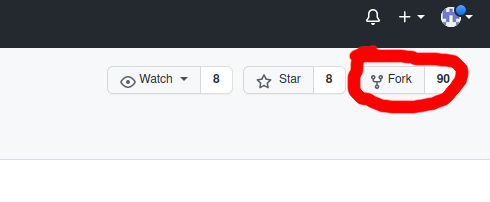

# RootsCoder

## Aufgabe

_What the??… #RootsCoder?? Ich glaub ich steh im Wald!_

_…dann aber hoffentlich in einem Mischwald. Sei ein produktiver Teil unseres Mischwald-Teams und bringe deine Stärken ein. Denn wir brauche jetzt jemanden, der Käfer zählt! Irgendwie haben es die kleinen Biester geschafft sich einzuschleichen. Wenn wir wissen, wie viele Käfer es schon sind, dann können wir die geeigneten Maßnahmen ergreifen und sie schnell los werden…da fällt dir gleich was ein? Dann hau in die Tasten und rette unseren Wald: schreibe deine Methode für „findeKaeferInBaum(baum)“ and: #savethewoods_

_Kleine Info für alle, die jetzt nicht so im Baumthema drin sind: eine Monokultur kann sich nicht gut wehren. Nicht gegen Sturm, nicht gegen Trockenheit und auch nicht gegen Schädlinge. Aber ein Mischwald, der aus individuell gewachsenen Bäumen besteht, die sich gegenseitig helfen und beschützen – der kann das wohl. Seine Wurzeln arbeiten symbiotisch nicht nur mit Pilzen – auch untereinander._

_Die Kronen lassen kleineren Bäumen Licht und stärken diese somit. Sie kommunizieren auch über Duftstoffe und warnen vor Gefahr. So kann ein gesunder Baum dank einer Warnung ein spezielles Harz produzieren, welches Käfer abschreckt. Eben Teamwork und Rücksichtnahme. Der Mischwald._

## Erklärungen

Was genau ist für dich zu tun? Ganz einfach: Forke das offizielle Repository. Log dich dazu bei github ein und klicke auf den "Fork" Knopf oben rechts:

 

Im Popup klickst du dann auf deinen Account. Danach wechselt die Ansicht automatisch zu deinem geforkten Repo. Das kannst du jetzt auf deinen PC klonen (auf dem grünen Knopf "Code") und dort die Aufgabe bearbeiten, indem du die Methode "findeKaeferInBaum" in der Klasse "Main" implementierst.

Wenn du fertig bist, pushed du deine Änderungen in dein geforktes Repo und schickst uns den Link (aus dem Browser) zu deinem Fork an [peopleandculture@exxcellent.de](mailto:peopleandculture@exxcellent.de).

## Test

Wenn du deine Implementierung testen möchtest, haben wir in der Klasse "Test" eine Möglichkeit eingefügt, dein Ergebnis anhand eines Baums mit bekannter Anzahl Kaefer zu überprüfen. Deine Routine sollte natürlich auch für zufallsgenerierten Bäume korrekte Ergebnisse liefern.
